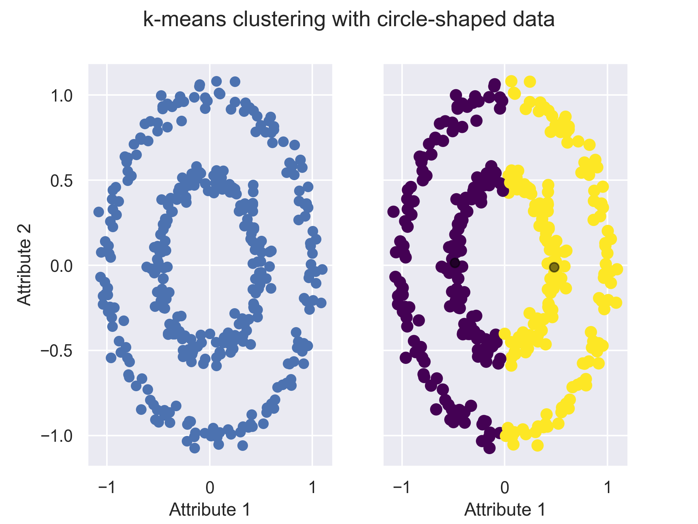

# Documentation k-means-clustering
This software is about an application of the k-means clustering algorithm using Python. It shows the advantages and disadvantages of the algorithm depending on the dataset type.
The software is divided into several sections (steps) that include comments for understanding the software.

